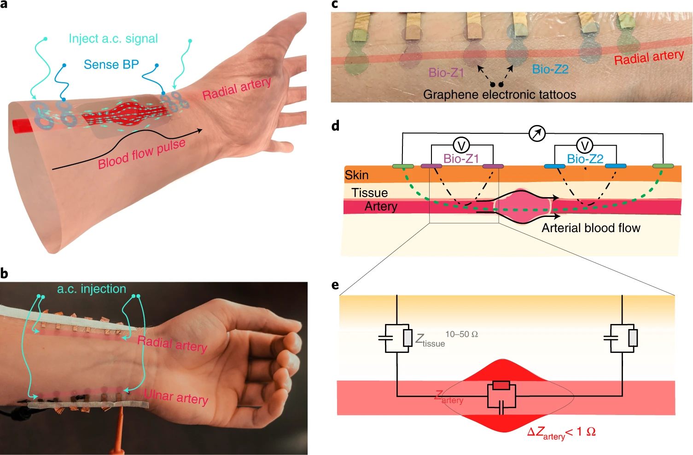
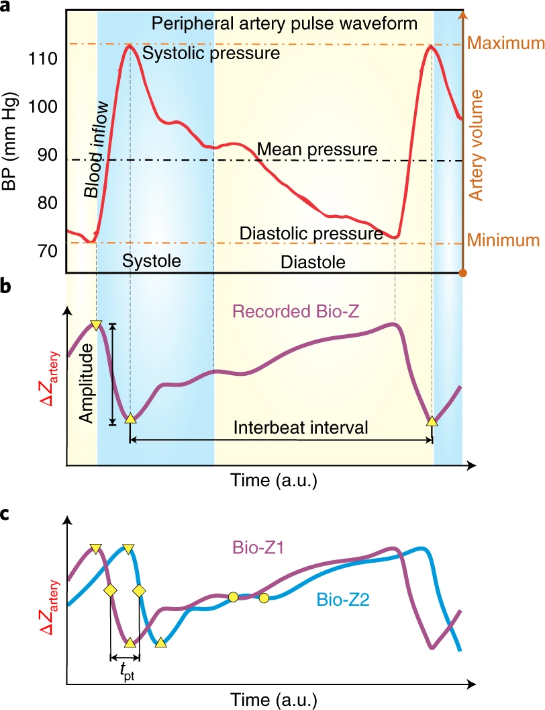
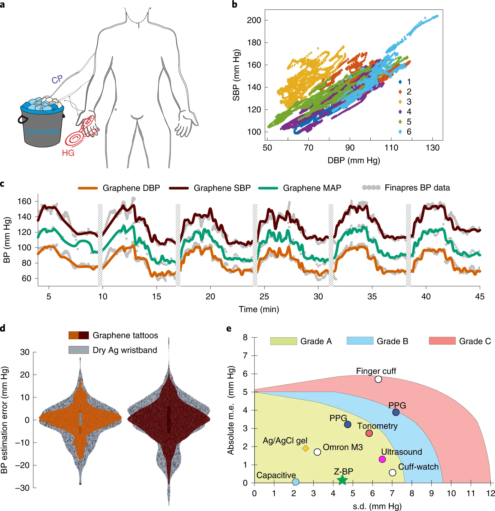
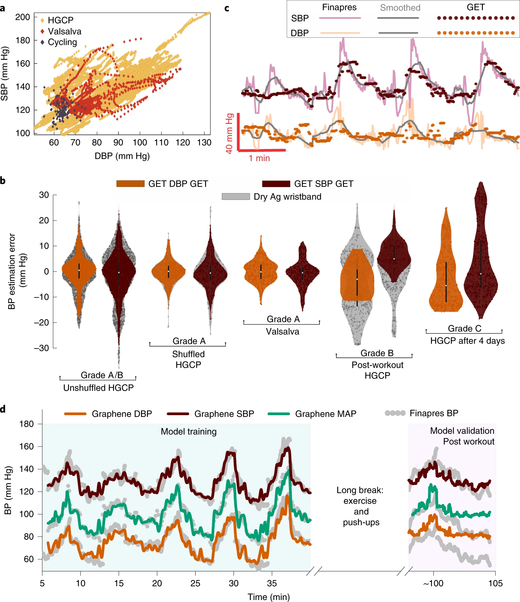
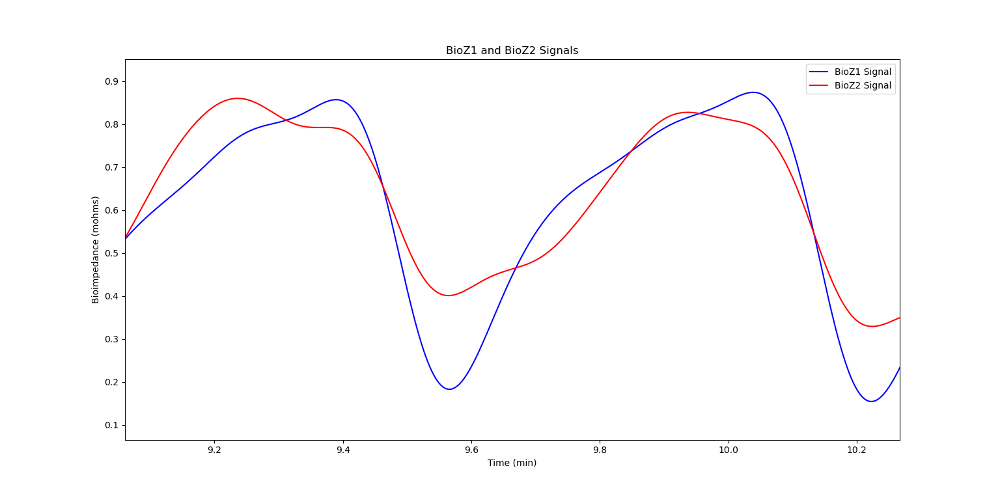
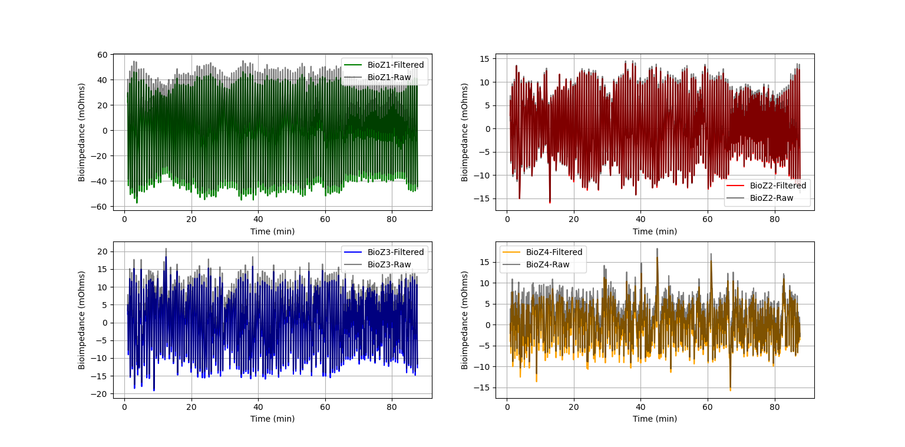
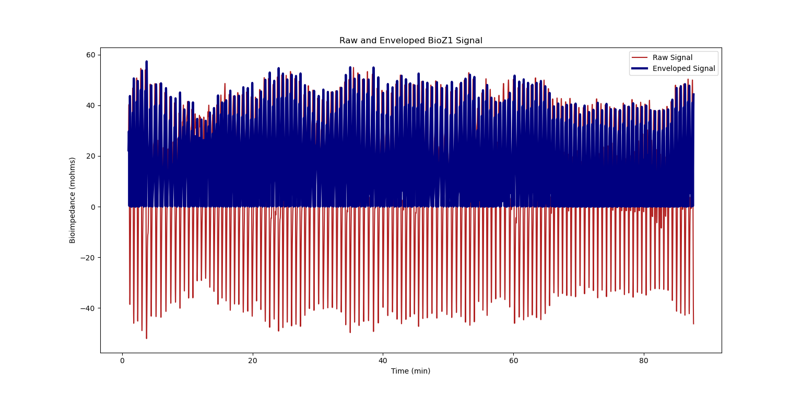
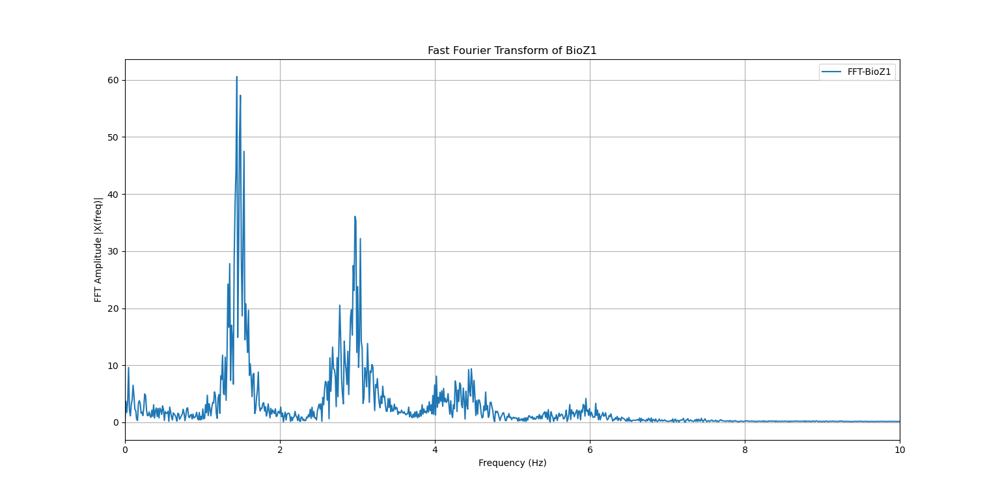
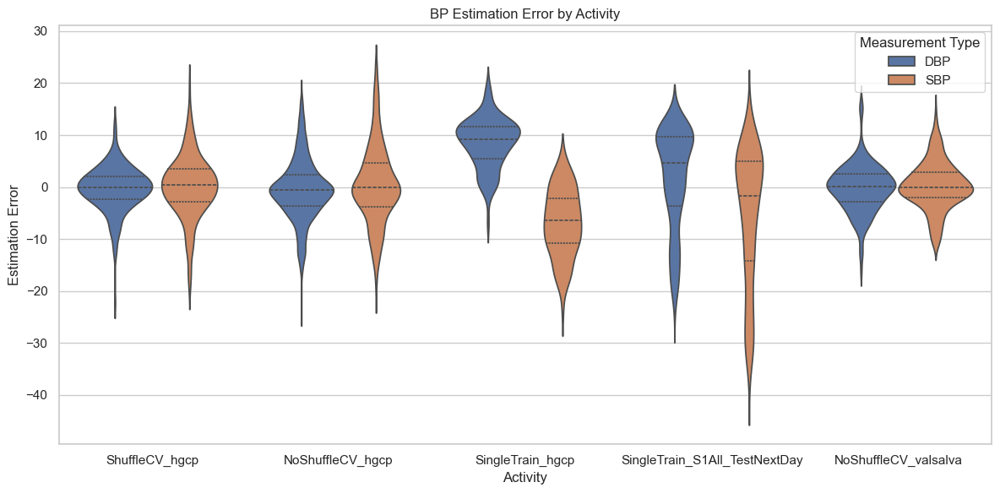
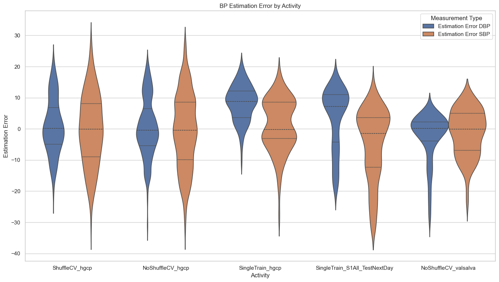

# Continuous Cuffless Monitoring of Arterial Blood Pressure Via Graphene Bioimpedance Tattoos

This repository contains the data, code, and documentation for the project **"Continuous Cuffless Monitoring of Arterial Blood Pressure Via Graphene Bioimpedance Tattoos."** The research aims to revolutionize blood pressure monitoring using graphene electronic tattoos (GETs) with advanced bioimpedance technology.

### Cuffless Monitoring of Arterial Blood Pressure Via Graphene Bioimpedance Tattoos


### Illustration of the peripheral arterial BP pulse waveform (red) and correlated arterial volume


## Project Overview
Blood pressure monitoring is critical for preventing cardiovascular diseases and managing conditions like hypertension. Traditional methods rely on bulky equipment and are unsuitable for continuous use. This project addresses these limitations by leveraging graphene-based GETs for non-invasive, continuous blood pressure monitoring. 

### Key Features
- **Wearable Technology:** Self-adhesive, low-impedance graphene tattoos placed on the wrist for high-fidelity measurements.
- **Bioimpedance Measurement:** Utilizes arterial bioimpedance to estimate blood pressure metrics such as SBP, DBP, and MAP.
- **Robust Against Motion Artifacts:** GETs are resilient to movement, ensuring consistent data collection during various activities.
- **Machine Learning Integration:** AdaBoost and Support Vector Machines (SVM) for real-time blood pressure prediction with Grade A accuracy.

## Repository Structure
```Graphene-Bioimpedance-Tattoos/
├── README.md
├── data/
│   ├── raw/
│   │   ├── BioZ/
│   │   ├── PPG/
│   │   ├── BP/
│   └── processed/
├── notebooks/
│   ├── preprocessing.ipynb
│   ├── feature_extraction.ipynb
│   ├── model_training.ipynb
│   └── results_analysis.ipynb
├── src/
│   ├── preprocessing/
│   │   ├── detrending.py
│   │   ├── filtering.py
│   │   ├── normalization.py
│   └── feature_extraction/
│       ├── statistical_features.py
│       ├── spectral_features.py
│       ├── temporal_features.py
│       ├── PTT_extraction.py
│   └── models/
│       ├── adaboost.py
│       ├── svm.py
├── reports/
│   ├── final_report.pdf
│   ├── figures/
│   │   ├── BioZ_signals.png
│   │   ├── BP_correlations.png
│   │   ├── FFT_spectra.png
│   │   └── model_comparisons.png
├── requirements.txt
└── LICENSE
```

## Experimental Design
Experiments were conducted on seven healthy participants under various conditions:
- **Hand Grip Cold Pressor (HGCP):** Gradual BP elevation through exercise and cold exposure.
- **Cycling:** Stationary cycling for increased BP followed by rest.
- **Valsalva Maneuver:** BP modulation through controlled breathing exercises.
- **Baseline and Rest:** Measurements in a neutral state for control data.

### Dataset Description
The dataset includes:
- **Bioimpedance (BioZ):** Signals recorded at 1250 Hz sampling rate.
- **Blood Pressure (BP):** Continuous measurements using Finapres NOVA at 200 Hz.
- **Photoplethysmography (PPG):** Finger-cuff and fingertip measurements at 75 Hz and 1250 Hz, respectively.

## Methodology
### 1. Data Preprocessing
- **Filtering:** Bandpass and low-pass filters to remove noise and preserve signal integrity.
- **Normalization:** Standardized signals to a range of [0, 1].
- **Envelope Extraction:** Hilbert transform for signal dynamics.
- **FFT Analysis:** Frequency-domain representations for spectral characteristics.

### 2. Feature Extraction
- **Statistical Features:** Mean, standard deviation, skewness, and kurtosis.
- **Temporal Features:** Zero-crossing rate, energy, and signal length.
- **Spectral Features:** Spread, centroid, entropy, and MFCCs.
- **Pulse Transit Time (PTT):** Time delay between signals from paired GETs.
- **Mean Slope:** Reflects dynamic arterial behavior.

### 3. Machine Learning
- **Models Used:**
  - **AdaBoost:** Superior performance with Grade A accuracy for BP prediction.
  - **SVM Regression:** Benchmark model for comparison.
- **Training Metrics:**
  - DBP: Mean error of 0.2 ± 4.6 mmHg.
  - SBP: Mean error of 0.2 ± 5.8 mmHg.
  - MAP: Derived from SBP and DBP values.

## Results
- **High Accuracy:** GETs outperformed traditional Ag electrodes with comparable Grade A accuracy.
- **Long-Term Stability:** Demonstrated no degradation in signal quality during extended use, even under challenging conditions like sweating and movement.
- **Versatility:** Capable of monitoring BP during diverse activities, including workouts and rest.

###  Graphene Z-BP measurement results from the HGCP routine


### Graphene Z-BP model training and performance evaluation


### Comparison of BioZ Signals


### Raw and Filtered BioZ Signal


### Raw and Enveloped BioZ Signal


### Fourier Transform of BioZ Signal


### Adaboost Model Results


### Support Regression Model Results


## Future Work
- Integration with smartwatches for seamless daily monitoring.
- Development of wireless data transmission and storage solutions.
- Expansion to larger datasets and clinical trials.

## Getting Started
1. Clone the repository:
   ```bash
   git clone https://github.com/yasin-peker/Continuous-Cuffless-Monitoring-of-Arterial-Blood-Pressure-Via-Graphene-Bioimpedance-Tattoos.git
2. Install dependencies:
   ```bash
   pip install -r requirements.txt
3. Explore the notebooks for detailed workflows.


## Acknowledgments

This project was inspired by the groundbreaking research conducted by Kyoseung Sim et al., titled **"Continuous cuffless monitoring of arterial blood pressure via graphene bioimpedance tattoos"**, published in *Nature Nanotechnology* (2022). The study introduced the potential of graphene electronic tattoos (GETs) as a platform for non-invasive and continuous health monitoring, which provided the foundation for our exploration of bioimpedance-based blood pressure monitoring.

You can access the original research paper here: [Continuous cuffless monitoring of arterial blood pressure via graphene bioimpedance tattoos](https://www.nature.com/articles/s41565-022-01145-w).


## License
This project is licensed under the MIT License. See the [LICENSE](./LICENSE) file for details.
